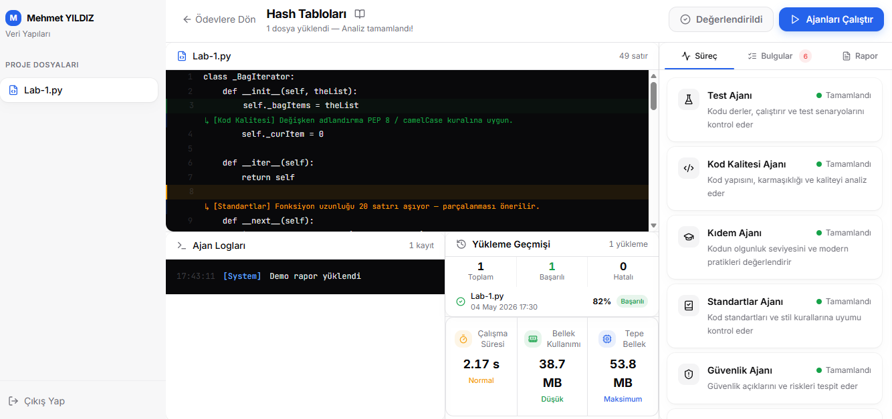
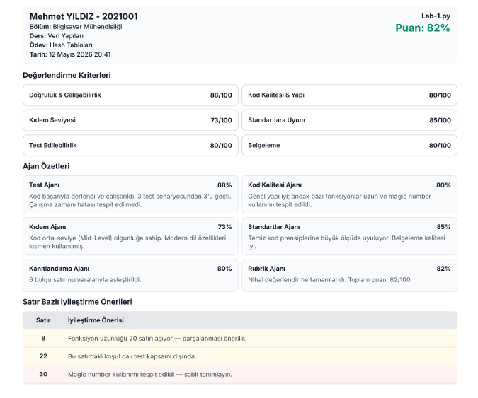
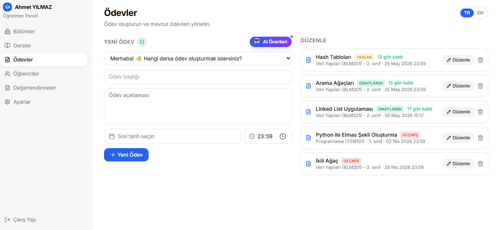
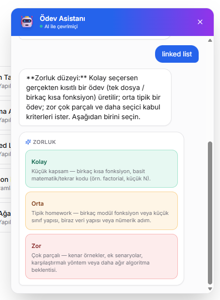

# CodeJury — AI-Powered Code Assessment Platform

[](https://www.python.org/)
[](https://nodejs.org/)
[](https://fastapi.tiangolo.com/)
[](https://react.dev/)
[](https://www.typescriptlang.org/)
[](https://www.docker.com/)
[](https://www.postgresql.org/)
[](https://redis.io/)
[](https://ollama.com/)
[](https://www.gnu.org/licenses/agpl-3.0)

---

## Overview

**CodeJury** is an AI-powered programming assignment evaluation platform designed for both educators and students.

The platform automates:
- Assignment generation
- Rubric creation
- Secure code execution
- Multi-agent code analysis
- Automated grading and reporting

Teachers can create assignments with minimal input, while students receive instant feedback, detailed analysis, and downloadable evaluation reports.

---

## Key Features

### AI-Powered Multi-Agent Evaluation
- 7 specialized AI agents working in parallel
- Automated rubric-based grading
- Static analysis and code quality inspection
- Security vulnerability analysis
- Seniority and competency evaluation
- Line-level evidence matching

### Secure Sandbox Execution
- Docker-based isolated execution
- Pre-warmed container pool
- CPU/RAM/Network isolation
- Python, C++, and Java support

### Assignment Management
- AI-assisted assignment creation
- Interactive chatbot workflow
- Course and student management
- Custom rubric configuration

### Reporting System
- Downloadable PDF evaluation reports
- Detailed scoring breakdown
- Line-by-line improvement suggestions
- Rubric-based feedback generation

---

## Architecture Overview

```text
┌───────────────────────────────────────────────────────┐
│          Student / Teacher Interface (React)          │
│   • Student/Teacher dashboards                        │
│   • Course & assignment management                    │
│   • Assignment creation chatbot                       │
│   • Code editor                                       │
│   • Evaluation reports                                │
└────────────────────┬──────────────────────────────────┘
                     │ (REST API)
                     ▼
┌───────────────────────────────────────────────────────┐
│            FastAPI Backend - Port 8001                │
├──────────────────┬──────────────────┬─────────────────┤
│  Static Analysis │  Sandbox Pool    │  Database Layer │
├──────────────────┼──────────────────┼─────────────────┤
│ • Code Quality   │ • 10 Containers  │ • PostgreSQL    │
│ • Seniority      │ • Python 3       │ • Redis         │
│ • Standards      │ • C++ / Java     │                 │
│ • Security       │ • Isolation      │                 │
│ • Testing        │                  │                 │
└──────────────────┴──────────────────┴─────────────────┘
```

---

## AI Agents

| Agent | Responsibility |
|------|----------------|
| Testing Agent | Test execution and runtime validation |
| Code Quality Agent | Complexity and maintainability analysis |
| Seniority Agent | Competency and seniority evaluation |
| Guideline Agent | Coding standards inspection |
| Evidence Agent | Line-level evidence generation |
| Security Agent | Security vulnerability analysis |
| Orchestrator Agent | Final scoring and rubric orchestration |

---

## Screenshots

### Student Workspace



### Evaluation Report



### Assignment Creation



### Interactive Chatbot



---

## System Requirements

| Component | Minimum Version | Required | Description |
|-----------|----------------|----------|-------------|
| Python | 3.11+ | ✓ | Backend and agents |
| Node.js | 18+ | ✓ | Frontend |
| npm | 9+ | ✓ | Package manager |
| Docker Desktop | 24+ | ✓ | Sandbox containers |
| docker compose | v2+ | ✓ | Multi-container orchestration |
| PostgreSQL | 14+ | ✓ | Database |
| Redis | 7+ | ✓ | Cache and job queue |
| Ollama | Latest | ✓ | Local LLM models |
| RAM | 8 GB | Recommended | 16 GB recommended |
| Disk Space | 10 GB | Recommended | Containers + models |

---

## Operating System Notes

- **Windows 10/11**: Docker Desktop with WSL2 backend is recommended
- **macOS (Intel/Apple Silicon)**: Docker Desktop is recommended
- **Linux (Ubuntu 22.04+)**: `docker.io` and `docker-compose-plugin` packages are recommended

---

## Official Download Links

- **Python**: https://www.python.org/downloads/
- **Node.js**: https://nodejs.org/
- **Docker Desktop**: https://www.docker.com/products/docker-desktop/
- **PostgreSQL**: https://www.postgresql.org/download/
- **Redis**: https://redis.io/download
- **Ollama**: https://ollama.com/download
- **Git**: https://git-scm.com/

---

## Prerequisites Check

To verify that all required tools are installed on your system:

```bash
# PowerShell (Windows)
node scripts/check-prereqs.mjs

# or via npm
npm run check:prereqs
```

Example successful output:

```text
[OK]    Python             python 3.12.0
[OK]    Node.js            v20.10.0
[OK]    npm                10.2.3
[OK]    Docker             Docker version 27.0.3
[OK]    docker compose     Docker Compose version v2.29.0
[OK]    Ollama             ollama version 0.3.6 (http://localhost:11434)
```

If an **[ERROR]** line appears, that component must be installed.

**[WARN]** lines are optional warnings (e.g., Docker daemon not running).

---

## Notes

If Docker Desktop is installed, the `docker-compose up` command will automatically start PostgreSQL and Redis services.

For manual installation, both databases must be installed separately on the system.

---

## Step 1: Clone the Repository

```bash
git clone https://github.com/agentgrade/codejury.git
cd CodeJury
```

---

## Step 2: Automatic Installation

### Windows (PowerShell)

```powershell
# Full installation (Docker + Ollama + PostgreSQL included)
powershell -ExecutionPolicy Bypass -File scripts\install.ps1

# Demo mode (quick setup without Docker)
powershell -ExecutionPolicy Bypass -File scripts\install.ps1 -DemoMode

# Skip PostgreSQL and Sandbox setup
powershell -ExecutionPolicy Bypass -File scripts\install.ps1 -NoPostgres -NoSandbox
```

### Linux / macOS

```bash
# Full installation
bash scripts/install.sh

# Demo mode
bash scripts/install.sh --demo

# Install dependencies only
bash scripts/install.sh --no-postgres --no-sandbox --no-ollama
```

### npm Shortcuts

```bash
# Start automatic setup wizard
npm run setup

# Demo mode
npm run setup:demo

# Skip prerequisite checks
npm run setup:skip-checks
```

---

## Step 3: Start Services

### Option A: Full Startup (Recommended)

```bash
# Start all services: PostgreSQL, Redis, Backend, Frontend
npm run dev:full
```

The browser will automatically open:

- **Frontend**: http://localhost:8080
- **Backend API**: http://localhost:8001
- **PostgreSQL**: localhost:5432
- **Redis**: localhost:6379

---

### Option B: Manual Startup

### Terminal 1 — Docker Services

```bash
docker-compose up postgres redis
```

### Terminal 2 — Backend

```bash
# Activate Python virtual environment (Windows)
.\.venv\Scripts\Activate.ps1

# or (Linux/macOS)
source venv/bin/activate

# Start backend
cd backend
python main.py
```

### Terminal 3 — Frontend

```bash
cd frontend
npm run dev
```

---

For detailed installation instructions, troubleshooting, Docker configuration, and platform-specific setup:

👉 [INSTALL.md](./INSTALL.md)

## Contributing

Contributions, ideas, and feature suggestions are welcome.

Please open an issue before submitting major architectural changes.

For ideas, collaborations, architectural improvements, or contribution discussions, you may contact:

### VisusVision — Visus Artificial Vision and Automation Systems

---

## License

This project is licensed under the **AGPL v3 License**.

See:
- [LICENSE](./LICENSE)

