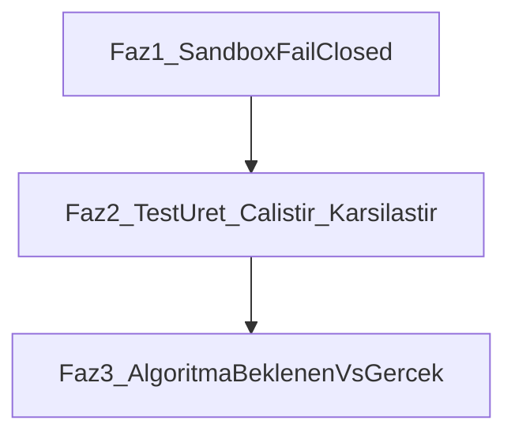

# Sandbox → Test → Algoritma Yol Haritası

## Bağlam

Mevcut mimari doğru katmanlara sahip, ama grading yolu sessizce bozulabiliyor:

- [`backend/sandbox/executor.py`](backend/sandbox/executor.py): pool yoksa / HTTP hata olursa `_simulate_sandbox()` (host subprocess, izole değil)
- [`frontend/src/lib/analysisPreflight.ts`](frontend/src/lib/analysisPreflight.ts): simulation’da sadece uyarı, analizi engellemiyor
- Test ajanı test üretmiyor; faculty case’leri + smoke/static fallback
- Algoritma ajanı Big-O gap üretiyor ama Master Evaluator `algorithmic_efficiency` için `code_quality` kullanıyor

## Kararlar (netleşen)

- **Docker her zaman açık** → grading yolunda simulation kabul edilmez (fail-closed + kısa retry).
- **Pool startup:** background init; health `degraded` + `pool_ready=false` iken UI/pipeline analiz engeller (blocking boot yok).
- **Test kaynağı (hybrid):**
  1. Öğretmen ödev ekranında AI ile test üretebilir, düzenleyebilir, kaydeder.
  2. Elle/AI ile hiç test girilmemişse grading anında sistem ödevden otomatik test üretir ve sandbox’ta çalıştırır.
  3. Kaydedilmiş faculty testleri varsa grading yalnızca onları kullanır (üzerine sessizce yeni test eklenmez).
- **Oracle (beklenen çıktı):**
  - **Şimdi (Faz 2):** LLM-only — ödev metninden stdin + expected_stdout üretilir; öğrenci kodundan expected asla türetilmez.
  - **Sonra (Faz 2.5 / opsiyonel):** Hidden reference solution — öğretmen/AI referans çözüm tutar; sandbox’ta referans çalıştırılıp expected alınır, sonra öğrenci aynı inputlarla karşılaştırılır.
  - Auto-gen raporlarda `oracle: llm` (ve ileride `oracle: reference`) işaretlenir; LLM oracle için UI’da “doğrulanmamış oracle” uyarısı gösterilebilir.
- **Algoritma ajanı ↔ rubrik:** Mevcut Master Evaluator wiring **değişmez**. Algorithm ajanı kendi skorunu + gap raporunu üretir; rubrik/`algorithmic_efficiency`’e yeni bağ yok.
- **Dil kapsamı:** Bu plan **Python-first**. Faz 1 fail-closed tüm dillerde geçerli (simulation yok), ama Faz 2 test üretimi / fixture / oracle ve Faz 3 derin AST analizi önce Python; C++/Java sonraki sprint.
- **Auto-gen hata politikası:** Grading-time test üretimi başarısız olursa **1 retry**; yine olmazsa **fail-soft** — analiz devam eder, TestAgent “test üretilemedi / formal test yok” raporlar, skor sınırlı (smoke auto-pass yok). Job fail olmaz.
- **Çıktı karşılaştırması (normalized, tek politika):**
  - Trim + CRLF→LF + satır sonu trailing whitespace sil
  - Çoklu boşluk/tab → tek boşluk (satır içi)
  - Boş satırları koru ama uçtaki boş satırları yok say
  - Her iki taraf da “sayı gibi” görünüyorsa float toleransı `1e-6` (veya relative `1e-9`)
  - Aksi halde normalize edilmiş string eşitliği
  - Orchestrator + TestAgent fallback aynı helper’ı kullanır (çift standart yok)
  - Faculty case’te şimdilik ayrı `compare` flag yok; ileride eklenebilir
- **Auto-gen / AI suggest test sayısı (zorluğa göre):**
  - Kolay: 4–5 case (≈2 happy + 1–2 edge + 1 hata/boş)
  - Orta: 7–8 case
  - Zor: 10–12 case
  - Zorluk sinyali: mevcut ödev/rubrik difficulty alanından; yoksa brief uzunluğu + anahtar kelime heuristiği (rubrik suggest ile aynı ruh)
- **Öğrenci görünürlüğü:** Yalnızca `public` case’lerde expected/actual/detay; `hidden` case’lerde sadece pass/fail özeti (sayı). Öğretmen/faculty raporunda tüm detay görünür. Auto-gen varsayılan visibility: çoğunluk hidden + 1–2 public örnek (öğretmen sonradan değiştirebilir; grading-time ephemeral set aynı kural).
- **Faculty AI suggest UX:** Suggest endpoint yalnızca öneri listesi döner; DB’ye otomatik yazılmaz. Öğretmen seçerek ekler veya “hepsini değiştir” ile bilinçli replace yapar (mevcut case’ler sessizce silinmez).
- **Algoritma expected kaynağı:** faculty hint (`expected_complexity` / `expected_approach`) > brief LLM/regex > unknown; koddan expected yok.
- **Algoritma ajanı görevi:** kullanılan algoritmaları değerlendir; beklenen vs gerçek karmaşıklığı kıyasla; **beklenenden daha karmaşıksa belirt**; doğru olması gereken durumu (Big-O + yaklaşım) göster — rubrik wiring değişmez.
- **Algoritma ajan skoru (kendi kartı):** Gap’e göre kademeli ceza; LLM yüksek skor verse bile merge programmatic tavan uygular:
  - `matches_expected` / `better_than_expected`: ceza yok
  - `worse_than_expected` 1 seviye (örn. O(n)→O(n log n) veya O(n)→O(n²) tek adım): skor tavanı ~65, taban ceza ≈ −20
  - 2+ seviye daha kötü: skor tavanı ~45, ceza ≈ −35
  - `unknown` (beklenen yok): gap cezası yok; nesting/heuristik cezaları kalabilir
  - Rubrik/final not etkilenmez (yalnızca algorithm agent `score`)
- **Dosya fixture’ları (AI):** Test üretimi (faculty suggest + grading auto-gen) stdin ile birlikte küçük CSV/TXT fixture’ları da üretir; öğretmen suggest panelinde görür/seçer. Mevcut `infer_sandbox_files` sentetik yolu yalnızca AI fixture yoksa son çare fallback.
- **Network/service/CLI:** Mevcut TestAgent forgiveness (service timeout, CLI usage, network) **olduğu gibi kalır**; bu planda sertleştirme yok.
- **Auto-gen tutarlılığı:** Grading-time üretim **ödev başına cache**lenir (ilk başarılı üretim → aynı set tüm öğrencilerde). Faculty case eklenince cache geçersiz. Öğretmen UI’da “kalıcı teste çevir” ile `assignment_test_cases`’e yükseltebilir (opsiyonel). Her analizde yeniden üretim yok (A/B adaletsizliği önlenir).
- **Test skorlaması:** Oranlı pass-rate — `passed/total` TestAgent skorunun ana sürücüsü (mevcut `_compute_test_score` ruhu korunur/sıkılaştırılır). Public/hidden görünürlük skoru etkilemez; ikisi de eşit ağırlıkta sayılır. Formal/auto case yoksa (auto-gen fail-soft) yüksek skor yok.
- **Test ajanı ana ürünü (HackerRank):** Öğrenciye public case’lerde Input / Expected Output / Your Output / Status gösterilir. Sandbox gerçek çalıştırma zorunlu. Runtime hatalar (ZeroDivisionError, IndexError, …) sınıflandırılıp fail + açıklama olarak raporlanır — bu, test ajanından birincil beklenti.

---

## Faz 1 — Gerçek sandbox zorunlu (şimdi)

### Hedef
Öğrenci kodu grading sırasında yalnızca Docker pool (`execution_backend: "pool"`) içinde çalışsın. Pool yoksa / container erişilemezse not üretilmesin.

### Kararlar
- **Fail-closed:** pool `None` / `not ready` / acquire timeout / container HTTP hatası → simulation’a düşme; yapılandırılmış hata dön
- **Kısa retry:** startup race için pool ready olana kadar ~10–15s / 2–3 deneme, sonra fail
- **Startup modeli:** Pool **background** init (API boot’u bloklamaz). Health: pool hazır değilken `sandbox.pool_ready=false` + overall status **`degraded`** (veya eşdeğer net alan). UI preflight analizi kilitler; pipeline da fail-closed. Blocking startup yok.
- **Test kaçış kapısı:** yalnızca `AGENTGRADE_ALLOW_SIMULATION=1` iken `_simulate_sandbox` (unit test / CI); production grading’de kapalı
- **Preflight hard block:** UI’da `pool_ready && mode === "pool"` değilse analiz başlatma

### Dokunulacak yerler
1. [`backend/sandbox/executor.py`](backend/sandbox/executor.py)
   - `run_in_sandbox`: simulation fallback kaldır (veya env flag arkasına al)
   - Pool hazır değilse `wait_until_ready` + sonra `SandboxUnavailableError`
   - RequestException’ta simulation yerine unhealthy mark + hata
2. [`backend/sandbox/pool_manager.py`](backend/sandbox/pool_manager.py) / [`pool.py`](backend/sandbox/pool.py)
   - `wait_until_ready(timeout)` helper
3. [`frontend/backend/main.py`](frontend/backend/main.py)
   - Pipeline sandbox hatasını yakala → job `failed` + Türkçe mesaj (“Sandbox kullanılamıyor; Docker/pool kontrol edin”)
   - Legacy `main.py::_simulate_sandbox` ölü kodunu kaldırma veya dokunmama (dar kapsam)
4. [`frontend/src/lib/analysisPreflight.ts`](frontend/src/lib/analysisPreflight.ts)
   - Simulation uyarısını `ok: false` hard fail’e çevir
5. [`backend/ops/runtime_diagnostics.py`](backend/ops/runtime_diagnostics.py)
   - Snapshot’ta `required: true` / fail nedeni alanı (opsiyonel ama faydalı)
6. Testler: [`backend/tests/test_sandbox_and_executor.py`](backend/tests/test_sandbox_and_executor.py), [`frontend/src/lib/analysisPreflight.test.ts`](frontend/src/lib/analysisPreflight.test.ts)
   - “pool yok → simulation” beklentilerini “pool yok → hata” olarak güncelle
   - Flag açıkken simulation hâlâ çalışır

### Doğrulama
- Pool ayaktayken: `execution_backend == "pool"`, test case’ler container’da koşar
- Pool kapalıyken: analiz başlamaz / job fail; host’ta öğrenci kodu çalışmaz
- Unit testler flag ile simulation path’i kapsar

---

## Faz 2 — Test üret → sandbox’ta çalıştır → karşılaştır (sonra)

### Hedef (ana beklenti — HackerRank tarzı)
Test ajanının asıl işi:
1. **Input / expected output** çiftlerini üretmek veya faculty’den almak
2. Öğrenciye HackerRank gibi göstermek: “Seni şu girdilerle test edeceğim; kodun çalışınca beklenen çıktılar bunlar”
3. Her case’i **gerçek sandbox’ta** çalıştırıp `actual_stdout` / `actual_stderr` / exit code almak
4. Expected ile karşılaştırmak (normalized)
5. **Runtime hatalarını algılamak ve sınıflandırmak** — örn. `ZeroDivisionError`, `IndexError`, `KeyError`, `TypeError`, `ValueError`, `FileNotFoundError`, timeout, memory — pass/fail yanında hata tipi + kısa Türkçe açıklama

Skor ikincil; birincil ürün = görünür I/O + sandbox gerçekliği + hata teşhisi.

### Kararlar
- **Faculty AI suggest:** gerçek LLM üretimi; response = öneri paneli (DB’ye yazılmaz); öğretmen seçerek ekler veya bilinçli replace (`source: ai` / `manual`)
- **Grading-time auto-gen:** faculty case yoksa üretici → **assignment-level cache** → sandbox; `source: auto_generated` + `oracle: llm`; DB faculty tablosuna yazılmaz (promote butonu ayrı)
- **Auto-gen fail:** 1 retry → fail-soft (analiz sürer, formal test yok uyarısı, sınırlı skor; smoke auto-pass yok)
- **Faculty case varsa:** yalnızca kayıtlı case’ler; auto-gen tetiklenmez
- **Oracle kuralı:** expected asla öğrenci kodundan üretilmez; Faz 2 LLM-only, ileride reference-solution path
- **Compare:** normalized (trim/whitespace/CRLF + sayısal float toleransı); orchestrator + agent aynı helper
- **Case count:** kolay 4–5 / orta 7–8 / zor 10–12 (difficulty sinyaline göre)
- **Smoke auto-pass kalkar** formal/auto case varken; static AST checks skor şişirmesin (ayrı sinyal olabilir)
- **HackerRank I/O kartı (öğrenci — public case’ler):** her case için `Input` | `Expected Output` | `Your Output` | `Status` (Pass/Fail/Error). Fail’de mismatch vurgusu; Error’de exception sınıfı + stderr özeti.
- **Hidden case’ler:** öğrenciye sadece “Gizli test X: Pass/Fail/Error” (I/O yok); faculty’de tam I/O.
- **Runtime error taxonomy:** sandbox stderr’den sınıflandır (`ZeroDivisionError` → “Sıfıra bölme”, vb.); `runtime_errors[]` + per-case `error_type` zorunlu alanlar. Division-by-zero ve benzeri uncaught exception’lar **fail** sayılır (forgiveness yok — service/CLI forgiveness ayrı, exception forgiveness değil).

### Ana işler
1. Ortak test üretici modül (LLM + şema doğrulama): case’ler + opsiyonel `files[]` fixture; faculty suggest + pipeline auto-gen paylaşır
2. Pipeline: case listesi + AI fixtures → `run_in_sandbox(..., test_cases=..., files=...)`; AI yoksa `infer_sandbox_files` fallback
3. TestAgent: sandbox `test_results` otoriter; per-case input/expected/actual/error_type; legacy multi-case bug kapat; **ortak normalized compare helper**; stderr → hata sınıflandırıcı
4. UI (AnalysisReport / testing kart): HackerRank tarzı I/O tablosu; public detay / hidden özet; “otomatik üretildi” + LLM-oracle uyarısı; suggest panelinde fixture önizleme

### Bağımlılık
Faz 1 tamamlanmadan anlamlı değil.

---

## Faz 3 — Algoritma ajanı: beklenen vs gerçek (en sonda)

### Hedef
Algoritma ajanı:
1. Kodda **kullanılan algoritmaları / veri yapılarını** tespit edip değerlendirir
2. Ödevden (faculty hint > brief) **beklenen karmaşıklık / yaklaşımı** çıkarır
3. Gerçek vs beklenen kıyaslar; **beklenenden daha karmaşıksa** (`worse_than_expected`) bunu açıkça belirtir
4. “Doğru olması gereken durum”u gösterir (beklenen Big-O + önerilen yaklaşım) — **rubrik/final notu etkilemez**

### Kararlar
- Expected öncelik: faculty hint > brief LLM/regex > unknown
- Çıktı: `detected_algorithms`, `time_complexity`, `expected_complexity`, `complexity_gap`, `recommended_approach`, gap explanation (neden daha karmaşık / ne olmalı)
- Rapor derinliği **orta:** Big-O + yaklaşım adı + gap gerekçesi; tam pseudo-kod / çözüm spoiler yok (öğrenciye)
- Master Evaluator wiring **değişmez**
- UI: beklenen vs gerçek + “beklenenden karmaşık” vurgusu; faculty hint varsa “öğretmen beklentisi” etiketi

### Ana işler
1. Assignment model/API: opsiyonel `expected_complexity` / `expected_approach` (demo + DB)
2. Brief/hint → yapılandırılmış expected; AST/heuristik → actual algorithms + Big-O
3. Gap: `worse_than_expected` / `matches` / `better` / `unknown` + Türkçe açıklama
4. Schema/UI: detected algorithms + gap + recommended_approach kartta
5. Merge: gap ile ajanın **kendi** skorunu hizala (1 seviye tavan ~65 / 2+ seviye tavan ~45); rubriğe gitmez
6. `code_quality` Big-O etiketlerini UI’da karıştırmamak

### Bağımlılık
Faz 1–2’den bağımsız geliştirilebilir; rapor kalitesi sandbox/test stabil olduktan sonra daha anlamlı.

---

## Bu oturumda uygulanacak kapsam

Yalnızca **Faz 1**. Faz 2–3 kararları bu dokümanda kilitli; her faz bitince uygulama o faza odaklanır.

## Karar özeti (hızlı referans)

| Konu | Karar |
|------|--------|
| Sandbox | Fail-closed; simulation sadece `AGENTGRADE_ALLOW_SIMULATION=1` |
| Pool boot | Background + health degraded + preflight block |
| Test kaynağı | Faculty AI suggest paneli; yoksa cached auto-gen |
| Oracle | Şimdi LLM; sonra reference solution |
| Compare | Normalized + float toleransı |
| Case count | Kolay 4–5 / orta 7–8 / zor 10–12 |
| Öğrenci UI | Public detay; hidden özet |
| Suggest UX | Öneri paneli; DB’ye otomatik yazma yok |
| Fixtures | AI üretir; sentetik son çare |
| Network/CLI | Mevcut forgiveness kalsın |
| Auto-gen fail | 1 retry → fail-soft |
| Test ajanı ürünü | HackerRank I/O (Input/Expected/Your Output) + runtime hata sınıflandırma |
| Test skor | Pass-rate oranlı |
| Dil | Python-first |
| Algorithm | Detect + expected vs actual; worse ise belirt; kendi skoru kademeli ceza; rubrik wiring aynı |
| Algorithm expected | Faculty hint > brief > unknown |
